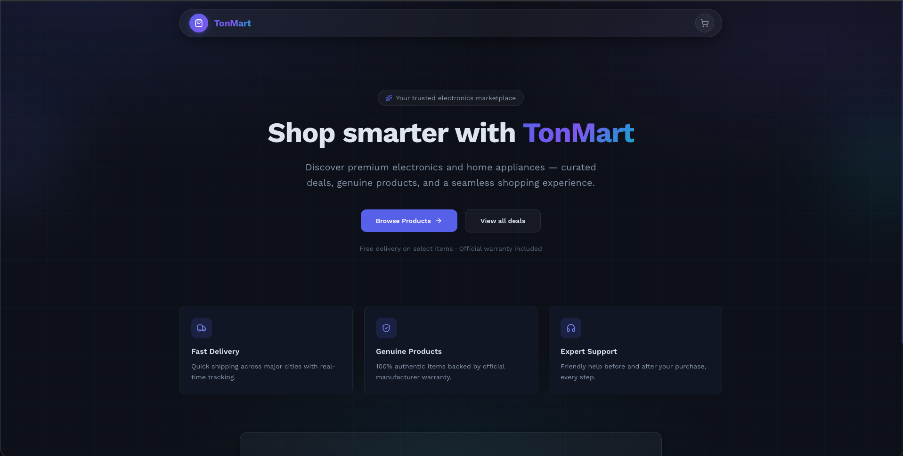
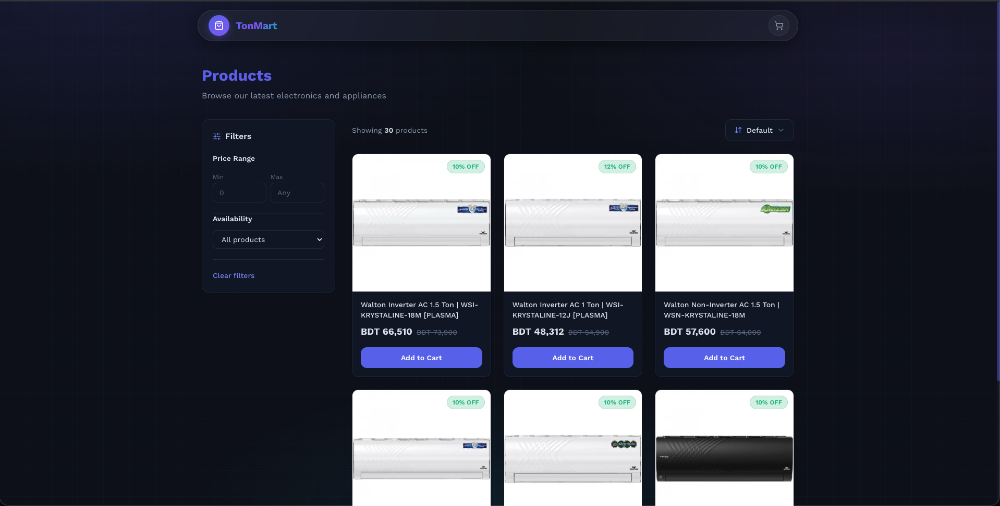
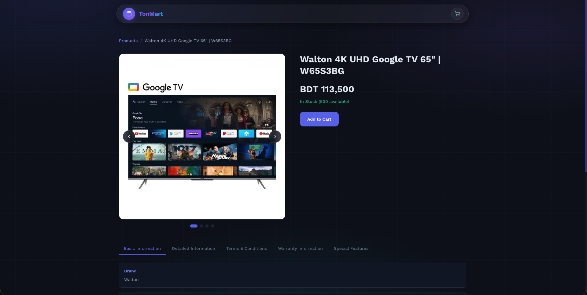
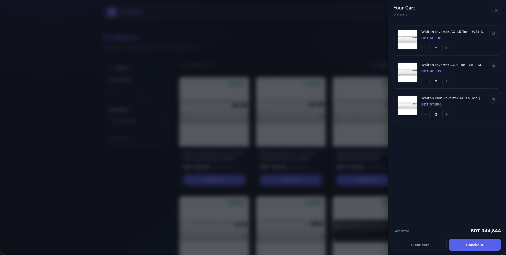

# TonMart

## Summary

TonMart is a responsive electronics and appliances storefront built with
Next.js and the Walton Plaza GraphQL API. Users can browse products, view
product details, filter and sort the loaded products, and manage a cart that
stays saved after a page reload.

## Submission links

- [Live application](https://tonmart.vercel.app/)
- [GitHub repository](https://github.com/Hasibul-Islam-Shanto/fe-project-submission)

## Screenshots

### Homepage

The responsive landing page introduces TonMart and provides direct links to the
product catalog.



### Product listing

The catalog shows product pricing, discounts, stock information, filters,
sorting, and add-to-cart actions.



### Product details

The details page shows the image gallery, price, stock, add-to-cart action, and
available product information tabs.



### Cart

The cart drawer provides quantity controls, item removal, subtotal, clear-cart,
and simulated checkout actions.



## Tech stacks

- Next.js 16
- React 19
- TypeScript
- Tailwind CSS 4
- Zustand 5
- GraphQL
- Zod
- ESLint, Prettier, and Husky

## Getting started

### Prerequisites

- Node.js 20 or later
- npm

### Installation

1. Install the dependencies:

   ```bash
   npm install
   ```

2. Create the local environment file:

   ```bash
   cp .env.example .env.local
   ```

3. Start the development server:

   ```bash
   npm run dev
   ```

4. Open [http://localhost:3000](http://localhost:3000).

## Environment variables

| Variable                       | Required | Description                                                                |
| ------------------------------ | -------- | -------------------------------------------------------------------------- |
| `NEXT_PUBLIC_GRAPHQL_ENDPOINT` | Yes      | Walton Plaza GraphQL endpoint                                              |
| `NEXT_PUBLIC_CART_MOCK_FAIL`   | No       | Set to `true` to simulate a failed add-to-cart request from a product card |

The example GraphQL endpoint is available in `.env.example`.

## Available scripts

| Command                | Description                                       |
| ---------------------- | ------------------------------------------------- |
| `npm run dev`          | Start the development server                      |
| `npm run build`        | Create a production build                         |
| `npm run start`        | Run the production build                          |
| `npm run lint`         | Run ESLint                                        |
| `npm run typecheck`    | Check TypeScript without creating build files     |
| `npm run format:check` | Check formatting with Prettier                    |
| `npm run validate`     | Run type checking, linting, and formatting checks |

## Feature checklist

- [x] Responsive landing page
- [x] Responsive product listing page
- [x] Product cards with images, price, discount, and stock information
- [x] Product details page with an image gallery and variant selection
- [x] Product information tabs based on the available API data
- [x] Loading, empty, error, and product-not-found states
- [x] URL-based filter, sorting, and page state
- [x] Desktop and mobile filter interfaces
- [x] Cart drawer with add, remove, clear, and quantity controls
- [x] Cart quantity limited by the available stock
- [x] Cart data saved in `localStorage`
- [x] Optimistic add-to-cart state with a simulated failure option
- [x] Simulated frontend checkout flow
- [ ] **Partially completed:** Pagination, filtering, and sorting work on the
      products loaded by the application, not all products reported by the API.
      See [Limitations](#limitations).
- [ ] **Not completed:** A GraphQL query client is not used. See
      [Limitations](#limitations).
- [ ] **Not completed:** GraphQL types are not generated from the schema. See
      [Limitations](#limitations).
- [ ] **Not completed:** Cart and checkout are not connected to a backend API.
      See [Limitations](#limitations).

## Architecture and decisions

### Data fetching

I wrote a small GraphQL fetcher and separate queries for the product list and
product details. Most product fetching happens on the server. I also normalize
the API response before using it in the UI so missing images, prices, variants,
or information sections do not break the page.

### Product list

The filter, sorting, and page values are stored in the URL:

```text
/products?minPrice=1000&maxPrice=50000&availability=in-stock&sort=price-asc&page=2
```

The server reads these values, loads an active-product catalog, applies the
filter and sorting rules, and then shows nine products for the selected page.
Changing a filter or sorting option returns the user to page 1.

I used this approach because the product API available to me did not provide
the price filter, availability filter, and price sorting queries needed by the
UI.

### Cart

I used Zustand for cart state and saved only the cart items in `localStorage`.
The cart drawer state is not saved. Product variants have separate cart IDs, and
the quantity cannot go above the available stock.

Product cards use React's `useOptimistic` and `useTransition` to show an
immediate add-to-cart state. A short delay acts like an API request. The
`NEXT_PUBLIC_CART_MOCK_FAIL` variable can be used to test the failure state.

## Trade-offs

- The custom GraphQL fetcher keeps product fetching mostly on the server and
  avoids adding another library, but I have to manage the queries, caching, and
  errors myself.
- Hand-written TypeScript types were easier for me to use, but they can become
  different from the GraphQL schema when the API changes.
- Local filtering and sorting allowed me to build the required UI, but the
  result is limited to the products returned to the application.
- The five-minute process cache reduces repeated product requests, but it can
  contain old data and is not shared between server instances.
- Zustand and `localStorage` make the cart work without a backend, but the cart
  is available only in the current browser.

## Limitations

### GraphQL query client

I did not use a GraphQL query client because I do not yet have enough experience
with GraphQL clients, and I wanted to keep most data fetching on the server. I
am still learning GraphQL. With more time, I can become comfortable with a
query client and start contributing with it.

### GraphQL types

I wrote the GraphQL response types manually instead of using GraphQL Code
Generator or a similar tool. This is related to the same GraphQL experience
limitation. The types work for the current queries, but they are not generated
automatically from the API schema.

### Pagination, filtering, and sorting

The API reports the total product count, but it returns a smaller product list
for the catalog request. The application currently filters, sorts, counts, and
paginates the products it receives. Because of this, the UI count and pages can
be lower than the total count reported by the API.

I chose this approach to match the filter and sorting requirements with the
queries I had available. Ideally, the API should receive the pagination,
filter, and sorting values, then return the matching products and the count
after filtering.

### Cart and checkout

I did not have cart and order mutation queries. The cart is therefore stored in
the browser, and checkout is only a simulated success flow.

## Improvements

- Learn and add a GraphQL query client while keeping server-side data fetching
  where it is useful.
- Generate TypeScript types from the GraphQL schema instead of maintaining them
  manually.
- Move pagination, filtering, sorting, and matching-product counts to the API.
- If the API cannot be changed, fetch its product pages in controlled batches
  and cache the complete result before applying local filters.
- Replace the simulated cart and checkout with backend mutations when those
  queries become available.
